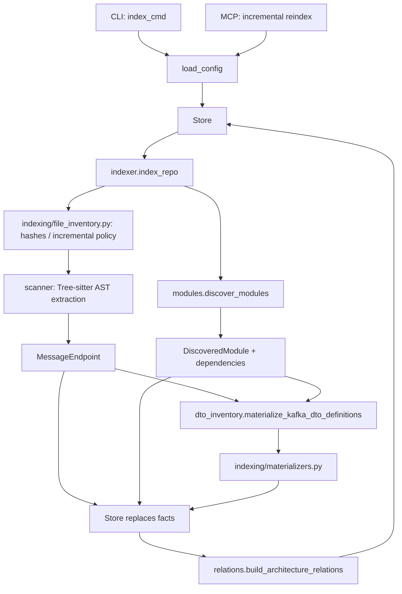
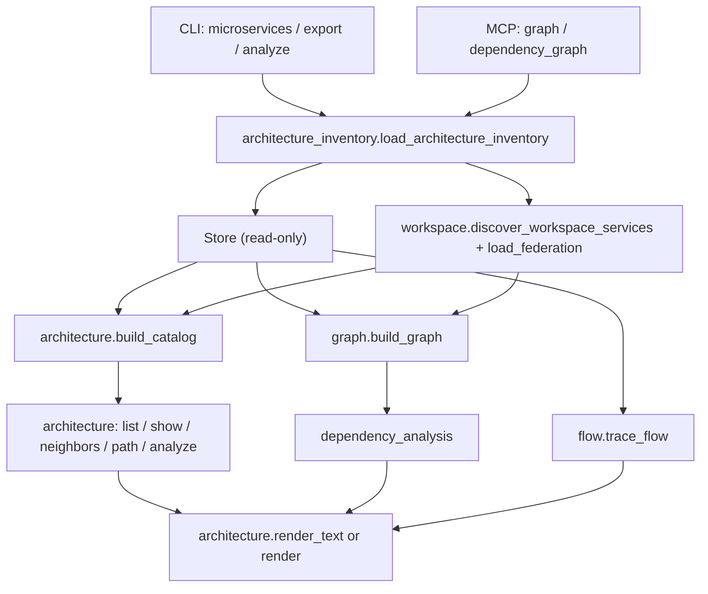

# Code architecture guide

This guide is the starting point for maintainers. It complements the detailed
contracts in `SPEC-TECH.md`: read this document to find the right ownership
boundary, then read the relevant specification before changing behaviour.

## How to use this guide

1. Find the relevant responsibility in [Ownership map](#ownership-map).
2. Follow the matching call hierarchy to identify the owner.
3. Read the linked functional or technical specification before changing a
   public contract or persisted fact.

The package boundaries are intentional: adapters deliver data, discovery
produces facts, and `Store` owns SQLite.

## Runtime layers

```
CLI / MCP adapters (`cli.py`, `mcp_server.py`)
                |
application queries and indexing (`architecture.py`, `architecture_inventory.py`,
`architecture_projection.py`,
`flow.py`, `dependency_analysis.py`, `indexer.py`, `workspace.py`)
                |
facts and discovery (`scanner/`, `modules.py`, `maven.py`, `gradle.py`,
`java_parser.py`, `relations.py`)
                |
models and persistence (`models.py`, `module_types.py`, `store.py`)
```

The `render/` package (formerly the single `render.py` file, still imported as
`from systemlens.render import ...`) is an output adapter. It may consume
query results and models, but must not perform indexing or persist data.
`indexing/` contains the repository-file inventory and snapshot materializers
used by the `indexer.py` application service. `config.py`, `paths.py`, and
`inventory_freshness.py` are small cross-cutting
utilities.

`scanner.py` was split into the `scanner/` package (see below) the same way:
`from systemlens.scanner import ...` is unchanged.

## Call hierarchies

These are the authoritative execution paths. Read each graph from top to
bottom; `Store` is the only component that owns the SQLite database.

### Indexing



`indexer.index_repo` is the orchestration root once input has crossed an
adapter. Scanner and module discovery are siblings: neither should orchestrate
the other.

### Architecture exploration



There are two valid sources of facts: the current repository index (`Store`)
or a read-only federation of separately indexed services (`workspace`).
`architecture_inventory.load_architecture_inventory` normalizes both sources,
including freshness and incomplete-federation warnings, before graph and audit
queries use them. The catalog, graph, dependency audit, and flow tracing are
all derived views: they must not write back to the index.

### Reading a call site

Start at its adapter decorator (`@app.command` or `@mcp.tool`), follow the
first non-private application function, then stop at either a query module or
`indexer.index_repo`. Private helpers only refine the behaviour of their owner;
they are not cross-module entry points.

## Ownership map

| Need to change | Start in |
|---|---|
| CLI parsing, option validation, exit code | `cli.py` |
| MCP tool signature or transport concern | `mcp_server.py` |
| A user query over the architecture inventory | `architecture.py`, `flow.py`, or `dependency_analysis.py` |
| Shared CLI/web graph selection | `architecture_projection.py` |
| Java AST endpoint extraction | `scanner/` package (`__init__.py` re-exports the public surface) |
| Maven/Gradle module facts or Java source inventory | `modules.py`, `maven.py`, `gradle.py` |
| Shared module inventory types | `module_types.py` |
| File eligibility or incremental refresh policy | `indexing/file_inventory.py` |
| Persisted contract materialization | `indexing/materializers.py` |
| SQLite schema or queries | `store.py` |
| JSON, terminal, HTML, or LikeC4 presentation | `render/` package (`__init__.py` re-exports the public surface) |

## The `scanner/` package

`scanner.py` (formerly 3100+ lines) was split into layers rather than by
line range: a dependency analysis showed 131 of its 154 top-level symbols
formed one connected component, so a naive contiguous cut would have been
unsafe. The layers below have no import cycles (each only imports from
layers above it in the table); the package's `__init__.py` is the only
import boundary other modules should rely on
(`from systemlens.scanner import ...`).

| Submodule | Responsibility |
|---|---|
| `_core.py` | Generic Java/text primitives shared by REST and Kafka inference: source reading, qualified-name/module resolution, generic-type parsing, message-type inference, `MessageEndpoint` construction |
| `_spring_properties.py` | Spring `application*.yml/properties` discovery and flattening, `${...}` property resolution, `@Value`-annotated field resolution |
| `rest_client_config.py` | "Configured API client" discovery (Strategy1 `Rest*Config*` classes and their external-service constants); also hosts the `_trace`/`_trace_rest_client` debug helpers used only here |
| `rest_mvc.py` | REST/OpenAPI inference (MVC, Feign, Spring Data REST, Swagger/OpenAPI generator, RestTemplate/RestClient, WebClient, WebFlux, Spring Cloud Gateway) and the `infer_framework_endpoints` orchestrator; imports from `_core.py`, `_spring_properties.py`, and `rest_client_config.py` |
| `kafka_ast.py` | AST-level Kafka endpoint inference (`@KafkaListener`, `KafkaTemplate`, `ProducerRecord`, Kafka Streams); imports from `_core.py` and `_spring_properties.py` |
| `kafka_conventions.py` | Strategy1 naming-convention Kafka inference plus Markdown/JSON topic-manifest inference; imports from `_core.py` and `kafka_ast.py` |
| `__init__.py` | Re-exports the public API and implements `clear_analysis_caches()`, which must reach into nearly every submodule to clear their `lru_cache`-decorated functions plus `java_parser`/`maven`/`gradle` caches |

Sharing leading-underscore helpers between these submodules (for example
`rest_mvc.py` importing `_build_endpoint` from `_core.py`, or
`kafka_conventions.py` importing `_kafka_endpoint` from `kafka_ast.py`) is the
same narrow, intentional exception to dependency rule 3 documented for the
`render/` package below: the package boundary, not the file boundary, is the
real contract. `relations.py` also imports the private
`_local_spring_application_names` directly from `systemlens.scanner` (a
pre-existing cross-module private import preserved by the split).

## The `render/` package

`render.py` (formerly 5000+ lines) is split by rendering concern. Each
submodule keeps a narrow responsibility and the package's `__init__.py` is
the only import boundary other modules should rely on
(`from systemlens.render import ...`); do not import a submodule path
directly from outside the package.

| Submodule | Responsibility |
|---|---|
| `search.py` | Text/JSON rendering for `search`/`summary` findings output |
| `graph_json.py` | JSON/text rendering of the endpoint-derived microservice graph |
| `graph_view_model.py` | Projects a persisted architecture snapshot into the browser-facing graph model; it performs no source discovery |
| `html_export.py` | Small standalone-document assembler for `systemlens export microservices --html`; serializes the graph model and injects ordered CSS/JavaScript modules into `assets/graph.html` |
| `likec4_export.py` | LikeC4 project export (`--c4`) and the request/reply HTML fragment |
| `module_graph.py` | Endpoint/module/workspace/flow rendering, plus the module-dependency HTML export (`assets/module_graph.html`) |
| `software_layers.py` | Dedicated software-layer rendering (`systemlens export layers`) with Strategy1 layer classification and `assets/software_layers.html` |
| `_graph_view_helpers.py` | Low-level helpers (VS Code deep links, MongoDB/REST visual edges) shared by graph projections |
| `assets/graph/*.css`, `assets/graph/*.js` | Ordered browser modules for the interactive graph; numeric prefixes make concatenation deterministic |
| `assets/graph.html`, `assets/module_graph.html` | Static HTML templates, injected with `.replace("__..._DATA__", json_payload)`; kept as plain HTML files rather than Python string constants |

`_graph_view_helpers.py` and the cross-import of `_complexity_ranking` /
`_vscode_file_uri` between these submodules are an
intentional, narrow exception to dependency rule 3 below: sharing a
leading-underscore helper is acceptable **within** the `render/` package,
because the package boundary (its `__init__.py`), not the file boundary, is
the actual contract. Reaching into `render/<submodule>.py` from *outside* the
package remains prohibited.

Kafka DTO materialization is owned by the top-level `dto_inventory.py` index
projection. `indexer.py` invokes its public function before persistence;
renderers consume the resulting snapshot facts and never participate in Java
source extraction.

## Dependency rules

1. Entry points adapt input and output; they do not implement discovery
   algorithms.
2. Discovery modules return models or typed facts and never import CLI, MCP,
   rendering, or persistence adapters.
3. Use a named public function for a cross-module dependency. Do not import a
   name beginning with `_` from another top-level module. Within the
   `render/` and `scanner/` packages, submodules may share leading-underscore
   helpers with each other (see their respective sections above); this does
   not extend to importing them from outside the package.
4. Add a focused test beside the owning module. End-to-end tests cover the
   adapter wiring; they are not the first home for an extraction rule.
5. Keep new output formats in the `render/` package (a focused new submodule
   if needed), not in query or discovery code.
6. Import module inventory dataclasses from `module_types.py` outside the
   discovery implementation. `modules.py` re-exports them only for historical
   compatibility.

Browser integration tests live in `tests/test_browser_export.py`. They are
marked both `integration` and `slow`, so they do not run in the default
unit-test suite. They prefer the executable configured in
`SYSTEMLENS_CHROME_BIN`, then local Google Chrome, then the Chromium revision
pinned by the installed Playwright package. Run the dedicated acceptance gate
with:

```bash
uv sync --group dev --locked
uv run playwright install --with-deps chromium
uv run pytest -m slow tests/test_browser_export.py
```

The browser acceptance command is a local/manual gate. The lockfile pins the
Playwright version, which in turn pins the Chromium revision used for local
validation. There is currently no GitHub Actions workflow for this gate.

## Diagnostics

Set `SYSTEMLENS_TRACE=1` to print stage-timing lines
(`SYSTEMLENS_TRACE ts=<monotonic> stage=<name> ...`) to stderr from `cli.py`,
`indexer.py`, `java_parser.py`, `modules.py`, and `graph.py`. This is an
internal debugging aid for slow-index investigations; it never changes
persisted facts, CLI/MCP output, or any documented contract.

## Maintenance focus

`cli.py` remains the largest module. `render.py` and `scanner.py` were split
into the `render/` and `scanner/` packages (see above); apply the same
approach — a narrow package with a single re-exporting `__init__.py` — before
`cli.py` grows unmanageable. Refactor behind named public contracts and
focused tests; behavioural CLI and MCP specifications remain the
compatibility gate.
